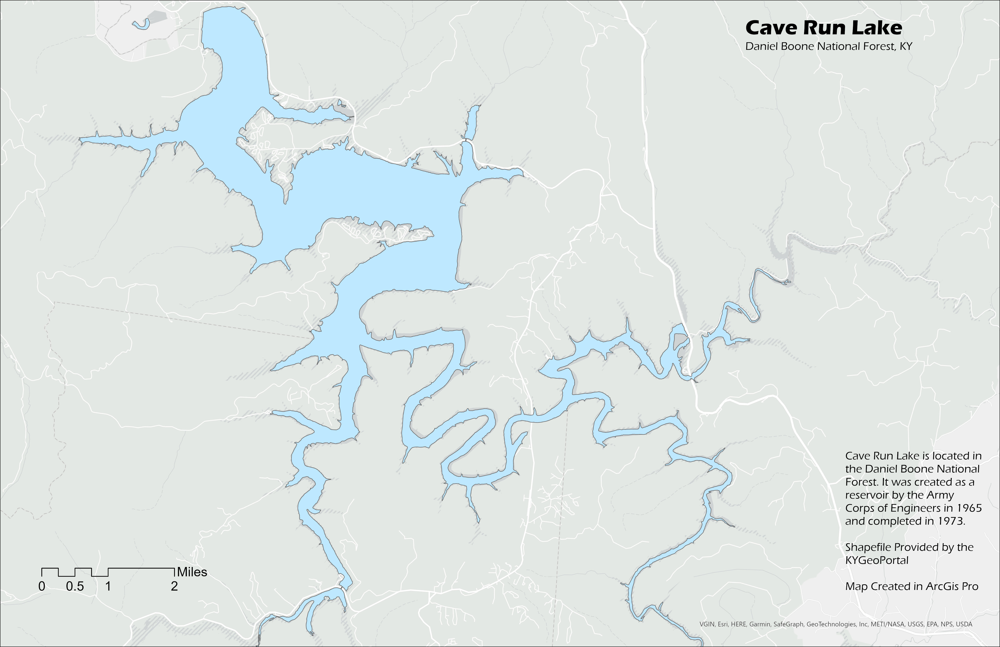
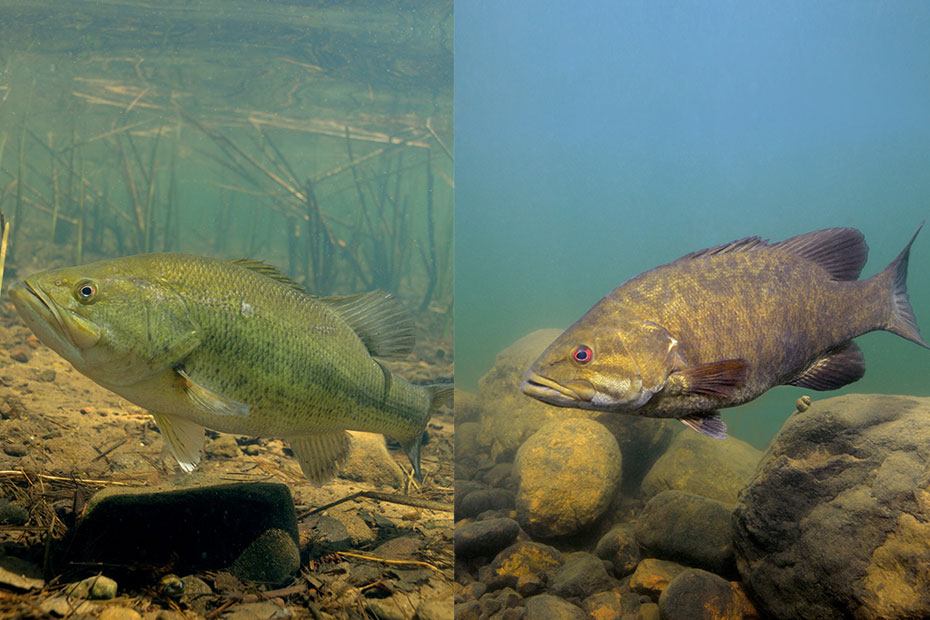
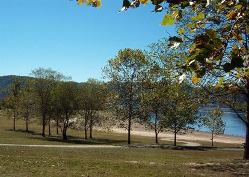

# CaveRunLake
## An interactive map of Cave Run Lake, KY

*[Click Here for Download!](CaveRunLakeTopoFixed.pdf)*

*[Click Here for Interactive Map!](map.html)*
## Cave Run Lake

Cave Run Lake is a lake located in the Daniel Boone National Forest. The lake is approximately 8,270 acres of water providing flood protecting and a clean water supply to local communities.It was created by the Army Corps of Engineers as a reservoir in 1965 and was completed in 1973. It is also home to a variety of fish and other wildlife in the area. In this website I will explain the different type of fish you can see here as well as what can be done at Cave Run.
## Fish

As mentioned above, the lake is home to a variety of different fish within the area including but not limted to:
* Largemouth Bass
* Smallmouth Bass
*  Spotted Bass
* Black Crappie
* White Crappie
* Bluegill
* White Bass
* Muskie 

The area also has quite a few different fishing spots located on the banks of the lake including:
* Muskie Bend Fishing Site
* Ramey Creek Fishing Site
* Shallow Flats Wildlife Viewing Area
* Windy Bay Fishing Site
## Camping

The lake also has a few different campsites throughout the area for tourists to come and stay overnight from regular campsites to RV hookups campgrounds are as follows:
* Claylick boat-in campground
* Clear Creek Campground
* Paragon Dispersed Camping Area
* Twin Knobs Recreation Area 
* White Sulphur Horse Camp
* Zilpo Recreation area 

## Hiking
Looking for a day out in the woods with a scenic view? Look no further! Cave Run Lake has a swath of different trails for beginners and families to people more familiarized with hiking! 
## Boating

The lake is also good for boating, swimming and tubing! with it's 8,270 acres of water and viewing, there is plenty of room to drive around and also stop to have relaxing day at the lake.
## Information
Want to learn more? visit this website to learn more about the exciting activities and general information regarding the lake! 

[Forest Service and USDA](https://www.fs.usda.gov/recarea/dbnf/recreation/recarea/?recid=39320)
